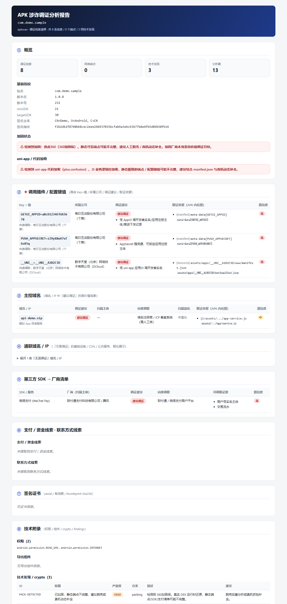

# fxapk

[](https://github.com/s-silt/fxapk/actions/workflows/ci.yml)
[](LICENSE)
[](https://www.python.org/)

*CLI 命令 `fxapk`（亦保留 `apkscan` 别名）；PyPI 包名 `fxapk`。* · **English**: [README.en.md](README.en.md)

> 面向**反诈调证**的 APK 静态分析 CLI —— 不止列出 IP/域名，而是产出**调证线索清单**：
> 每条线索回答「**这是什么、归属哪家公司、能去找谁调取什么证据**」。

`pip install` 即可运行核心功能，**零环境**（不需要 JDK / 模拟器 / 真机）。专为涉诈 App 取证设计：
抠出 App 里**真实配置的 key 值**（AppID / AppKey / AppSecret / 渠道号 / uni-app 应用 ID），
识别第三方服务与加固厂商并映射到**可调证主体**，对域名/IP 做**「是否建议调证」分级**，
把真正的诈骗服务器从成百上千条库/CDN 噪音里浮出来。

---

## 它产出什么（核心区别）

普通工具告诉你「检测到个推 SDK」；fxapk 告诉你 **具体值 + 所属公司 + 调证建议**：

```
调用插件 / 配置键值（CONFIG_KEY）
  GETUI_APPID    = aBcD1234EfGh5678        → 每日互动股份有限公司（个推）     [建议调证]
  PUSH_APPSECRET = zZ9yX8wV7uT6sR5q        → 每日互动股份有限公司（个推）     [建议调证·强凭据]
  __UNI__        = __UNI__A1B2C3D          → 数字天堂（北京）网络技术有限公司（DCloud） [建议调证]
   （示例值，已脱敏）

主控域名（建议调证 —— App 自有/疑似 C2）
  *.api-xxxxx.vip        建议调证：向注册商 / ICP 备案 / 云厂商调归属与租户
通联域名 / IP（无需调证 —— 已知基础设施，默认折叠）
  api.map.baidu.com / *.myqcloud.com / getui.net …

调证建议：凭上述 AppSecret 向【个推】调开发者账号实名、应用注册主体、推送下发记录。
```

实际渲染的 HTML 报告（**演示数据，已脱敏**）：



---

## 安装

要求 **Python 3.11+**。

```bash
# 从 PyPI
python -m pip install fxapk

# 或从源码
git clone https://github.com/s-silt/fxapk.git
cd fxapk
python -m pip install -e .
```

核心依赖：`androguard`（解析 APK）、`jinja2`、`typer`、`python-whois`、`requests`、`pyyaml`。

> 单元测试**不依赖 androguard、不联网、不需要真机/jadx/frida**（全部基于 `FakeContext` 合成数据）：
> ```bash
> python -m pip install jinja2 typer python-whois requests pyyaml pytest
> python -m pytest -q          # 487 passed
> ```

可选依赖（缺失时对应能力**优雅降级**，核心不受影响、不报错）：

| 可选项 | 启用的能力 |
|---|---|
| `jadx`（PATH 外部命令） | `jadx` 深度反编译增强器（不在 PATH 则自动跳过并在报告标注） |
| `frida-tools` + `frida-dexdump` | `unpack` 真机脱壳 |
| `mitmproxy` | `capture` 真机抓包流量解析 |
| Chrome / Edge / Chromium | `--fmt pdf` 报告导出（无头打印） |

---

## 快速开始

```bash
# 默认：联网富化归属，产出 HTML + JSON 到 out/
fxapk analyze app.apk --out out

# 离线（不联网），加导出 PDF
fxapk analyze app.apk --out out --offline --fmt html,json,pdf

# 只产 JSON（机器读 / 留档）
fxapk analyze app.apk --fmt json
```

**一键全自动**（接好真机/模拟器后，把体检→静态→脱壳→抓包→合并串成一条）：

```bash
# 接上设备后先体检（缺 frida-server / CA 等可自动修，修不了给可复制命令）
fxapk doctor

# 一键：doctor → 静态 → 脱壳 → 抓包（提示你在设备上操作 app）→ 合并一份总报告
fxapk auto app.apk --out out
# 无设备也能跑：自动跳过脱壳/抓包，仍产出静态报告
```

未安装为命令时等价用：`python -m apkscan.cli analyze app.apk --out out`。

### 常用参数

| 参数 | 说明 |
|---|---|
| `--out DIR` | 报告输出目录（默认 `out`） |
| `--fmt html,json,pdf` | 输出格式，逗号分隔（默认 `html,json`；`pdf` 需 Chrome/Edge） |
| `--online` / `--offline` | 是否联网富化 WHOIS / ICP 备案 / IP-ASN（默认联网） |
| `--extra-dex PATH` | 并入脱壳 dump 出的 `.dex`（文件或目录）一起静态分析 |
| `--dynamic` | 静态分析后若探测到在线设备，自动跑 `unpack` + `capture` |

---

## 输出

- `out/report.html` —— 自包含单文件（CSS 内联，可直接分享/手机打开）
- `out/report.json` —— `Report` 完整序列化（机器读 / 二次处理）
- `out/report.pdf` —— `--fmt pdf` 时由本机 Chrome/Edge 无头打印生成

**报告版式（按调证视角）**：概览（含加固/uni-app 加密标记）→ **★调用插件/配置键值（具体值）**
→ 主控域名（建议调证）/ 通联域名·IP（无需调证，折叠）→ 支付·SDK·联系方式·加固·签名线索
→ 网络端点全表（WHOIS/ICP/ASN 富化、明文/内网标记）→ 技术附录（权限/组件/证书/crypto/密钥）
→ 分析器与富化器运行状态（ran/skipped/error，透明不吞错）。

---

## 分析能力一览

**静态分析器（零环境，自动发现）**

| 分析器 | 产出 |
|---|---|
| `config_keys` ★ | manifest `<meta-data>` + uni-app 配置抠真实 `key=value`，映射调证主体；敏感凭据产 HIGH Finding |
| `sdk_fingerprint` | 第三方 SDK 指纹 → 厂商（支付/短信/推送/云存储/IM/统计/地图） |
| `payment` | 聚合支付/收款/商户号/USDT/钱包地址 → 资金线索 |
| `endpoints` | dex/资源/native/manifest 全量抽 URL/域名/IP（严格降噪） |
| `js_bundle` | uni-app/H5/RN 打包 JS **字符串字面量内**精确抽端点 + 硬编码密钥 |
| `jadx` | （需 jadx）深度反编译补端点/密钥 |
| `packing` | 加固厂商识别（梆梆/爱加密/360/腾讯乐固/娜迦/百度/网易易盾/阿里聚安全/几维）；**证据分级**：`.so`/特征文件才判已加固，仅 dex 名词命中降级为提示，避免误报 |
| `certificate` | 签名证书 → 跨样本关联同一开发者 |
| `contacts` | QQ/微信/Telegram/邮箱/手机号（带去误报） |
| `permissions` / `components` / `manifest` / `crypto` | 危险权限/导出组件/基础指纹/弱加密 |

**富化器（默认联网，`--offline` 可关，结果缓存）**：`whois`（注册人/注册商）、`icp`（ICP 备案主体）、`asn`（IP 归属云厂商/IDC）。

**「是否建议调证」分级**（`core/infra.py`）：命中公有云/主流 SDK/开源 CDN/标准协议/运营商域名 → 「无需调证」；私网/无效 → 「待核」；其余疑似 App 自有 → 「建议调证」。

---

## 真机动态补全（doctor / auto / unpack / capture）

真加固 App（DEX 加密、运行时还原）静态拿不到真实 C2，需要在 root 真机/模拟器上脱壳 + 抓包。
**接好设备后推荐直接用一键 `fxapk auto`**；也可分步：

```bash
fxapk doctor                            # 环境体检：设备/root/ABI/frida-server/CA 逐项检查，可自动修
fxapk auto app.apk --out out            # 一键：doctor→静态→脱壳→抓包→合并一份总报告
fxapk unpack app.apk --out out          # 单独脱壳：frida-dexdump dump 隐藏 DEX，回灌重分析
fxapk capture <package> --duration 60   # 单独抓包：mitmproxy + frida 绕证书绑定，抓运行时端点
```

**自动配环境**：`doctor`（及 `auto` 内部）能按设备 ABI + 主机 frida 版本**自动下载部署 frida-server**、**安装 mitmproxy CA 到系统信任库**（纯标准库下载，root 写入；装不了则如实降级并给命令——HTTPS 抓明文的命门绝不假成功）。
**运行时端点并回主报告**：`auto` / `analyze --dynamic` 会把抓到的运行时端点（真·C2，`source=runtime`）并入同一张调证线索清单并重渲报告。
**无设备/缺工具时不报错**：相关步骤 `status=skipped` + 打印**可逐条复制的取证手册**；静态报告照常产出。脱壳得到的 DEX 也可用 `fxapk analyze app.apk --extra-dex <dump_dir>` 手动并入。

> 设备/模拟器接入要点（adb 连接、root、ARM 兼容、frida 版本一致、CA 安装）见 [docs/dynamic-setup.md](docs/dynamic-setup.md)。
> 云端方案：在 root 真机 / 云手机（华为云手机、阿里无影等原生 ARM 安卓）上跑 frida-server，apkscan 部署在小 Linux VM 上经 ADB 驱动即可。

---

## 项目结构

```
apkscan/
  core/       models / context / apk(androguard 适配) / registry(自动发现) / pipeline / infra / device
  analyzers/  13 个静态分析器（见上表）
  enrichers/  whois / asn / icp
  dynamic/    doctor（体检）/ provision（自动配 frida-server·CA）/ unpack（脱壳）/ capture（抓包）/ merge（运行时端点并回）/ auto（一键编排）
  report/     html / json / pdf + templates/
  rules/      *.yaml（SDK/加固/支付/配置键/权限等规则库，数据与代码分离）
tests/        487 个单测（FakeContext，离线）
docs/         设计文档
```

---

## 合规边界

本工具仅用于**授权的反诈调证 / 安全研究**，只做分析与线索提取，**不提供任何攻击、绕过、规避检测能力**；
加固只识别不脱壳（脱壳为可选的真机取证步骤，需操作者自备授权环境），联网富化仅查公开的
WHOIS / ICP 备案 / ASN 信息。请在合法授权范围内使用。

## License

[MIT](LICENSE)
